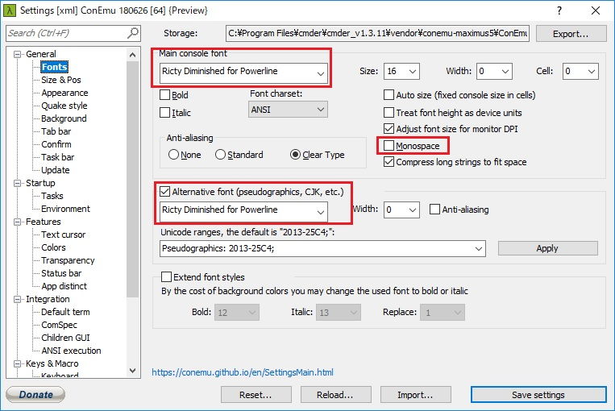

# Cmderセットアップ全般

## Cmderのセットアップ手順

### 前提

以下の手順はCmderでPowerShell及びWSL(WindowsSubsystemforLinux)を利用することを目標に記述する。  
Cmder標準のShellであるcmdでは日本語を完全に扱うことが不可能だと考えられるため、使用をしない。  
※以下の記事を参考にすれば、cmdを利用できるレベルにまで引き上げられるかもしれない。  

- [Cmderでオシャレにcmd.exeを使う -前編-](https://blog.mamansoft.net/2018/11/18/use-cmd-elegant-on-cmder-phase1/)
- [Cmderでオシャレにcmd.exeを使う -後編-](https://blog.mamansoft.net/2018/11/26/use-cmd-elegant-on-cmder-phase2/)

### Cmderのインストール

1. Cmderのインストール
    1. 下記のリンクより、最新版のCmderをインストールする。  
    [Dowonload Full]を実行する。  
   [Cmder](http://cmder.net/)
    2. ダウンロード後に解凍し、任意のディレクトリに保存する。  
    "C:\Program Files\cmder\cmder_{version}"等
    3. Cmderの初回起動を行って閉じる。

### Powerlineのインストール

1. Powerlineをインストールする。
   1. 以下リンク先よりダウンロードする。
    [Custom prompt for Cmder on Windows](https://github.com/AmrEldib/cmder-powerline-prompt)
   2. ダウンロードしてきたファイルの内、  
        ".lua"ファイルを"%CMDER_ROOT%/config"に保存する。  
        または、上記リンク先の"Setup"を参考に、取得してきたリポジトリから対象のファイルに対して、シンボリックリンクを生成する。
2. Powerline用のフォント設定  
    下記のフォントのいずれかをインストールする。
    - [RictyDiminished-for-Powerline](https://github.com/mzyy94/RictyDiminished-for-Powerline)
    - [Myrica](https://github.com/pomutemu/milly)
3. PowerShell用Powerlineをインストールする。
   1. 管理者権限でPowerShellを起動し、以下のコマンドを実行する。
        ```PowerShell
        PS> Install-Module PowerLine
        PS> Import-Module PowerLine
        ```
   2. 初期設定を実施する。  
       次のコマンドを実行し、
        ```PowerShell
        Set-PowerLinePrompt -SetCurrentDirectory -RestoreVirtualTerminal -Newline -Timestamp -Colors "#00DDFF","#0066FF"
        Export-PowerlinePrompt
        ```
   3. 詳細は下記を参照。  
    [A more PowerShell prompt](https://github.com/Jaykul/PowerLine)

### Cmderの設定変更

1. フォント設定を変更する。  
   次のように設定を変更する。フォントの変更はお好み。  
   

2. カーソルの位置がずれる問題の修正  
    1. cmdの設定変更  
    "%cmder_root%\config\powerline_core.lua"を以下のように変更する。
        ```Lua
        if not plc_prompt_lambSymbol then
        --  plc_prompt_lambSymbol = "λ"
            plc_prompt_lambSymbol = "$"
        end
        ```
    1. PowerShellの設定変更  
    "%cmder_root%\vendor\profile.ps1"内の箇所を、"λ"を"$"等に置き換える。
        ```PowerShell
        [ScriptBlock]$Prompt = {
        $realLASTEXITCODE = $LASTEXITCODE
        $host.UI.RawUI.WindowTitle = Microsoft.PowerShell.Management\Split-Path $pwd.ProviderPath -Leaf
        PrePrompt | Microsoft.PowerShell.Utility\Write-Host -NoNewline
        CmderPrompt
        #    Microsoft.PowerShell.Utility\Write-Host "`nλ " -NoNewLine -ForegroundColor "DarkGray"
            Microsoft.PowerShell.Utility\Write-Host "`n$" -NoNewLine -ForegroundColor "DarkGray"
            PostPrompt | Microsoft.PowerShell.Utility\Write-Host -NoNewline
            $global:LASTEXITCODE = $realLASTEXITCODE
            return " "
        }
        ```
3. コマンドをプロンプト1行目に入力する。  
    Cmderではコマンド入力が2行目になる、これを通常のcmdやBashのように1行目での入力に変更する。  
    ※本設定はお好みで実施。
   1. cmdの設定変更
   %cmder_root%\config\powerline_core.luaを以下のように変更する。
        ```Lua
        -- Symbols
        --newLineSymbol = "\n"
          newLineSymbol = ""
        ```

4. 起動直後のディレクトリをホームディレクトリに変更する。
   1. Cmderを起動し、次の手順で起動時のディレクトリを変更する。  
    Settings -> Startup -> Tasks -> 各シェルの実行引数に、次の値を追加する。  
    (cmd,PowerShell共通)
        ```cmd
        -new_console:d:%USERPROFILE%
        ```
   2. WSLで上記の手順の場合はWSLのホームディレクトリにならないため、以下の手順で変更する。
   ※上記の場合、"/home/&lt;username&gt;"ではなく"/mnt/c/Users/&lt;username&gt;"が初期ディレクトリとなる。  
      1. "~/.bashrc"内に以下を追記する。
        ```bash
        # Change Default Directory
        cwd="$(pwd)"
        if [ ! $cwd = $HOME ]; then
            cd $HOME
        fi
        ```

### Vimの設定

Windows上でVimを利用する場合は、以下を設定する。

1. Cmderを開いて、以下のコマンドでテンプレートをコピーする。  
 ※ 既に%HOME%\\_vimrcか%HOME%\\.vimrcが存在する場合は、  
上書きすると既存設定が上書きされるので注意。
    ```powershell
    cp "%CMDER_ROOT%\vendor\git-for-windows\etc\vimrc" "%HOME%\_vimrc"
    ```

    下記の内容を_vimrcに追加。
    ```vim
    set number
    set encoding=utf-8
    set fileencodings=utf-8,cp932
    ```
